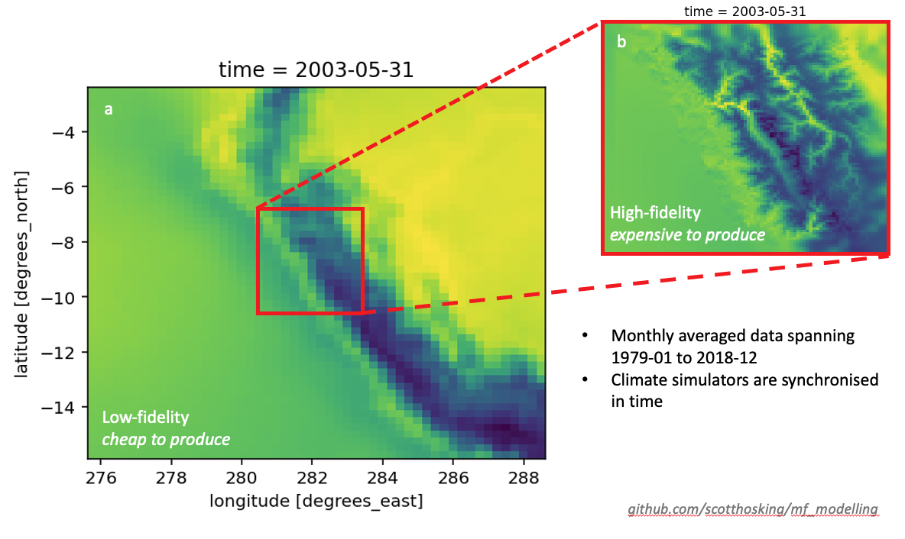

# Multifidelity Climate Modelling 

## Potentially useful external datasets
* https://climatedataguide.ucar.edu/climate-data
  * e.g., [Nino 3.4](https://climatedataguide.ucar.edu/climate-data/nino-sst-indices-nino-12-3-34-4-oni-and-tni)

## Schematic of data challege

